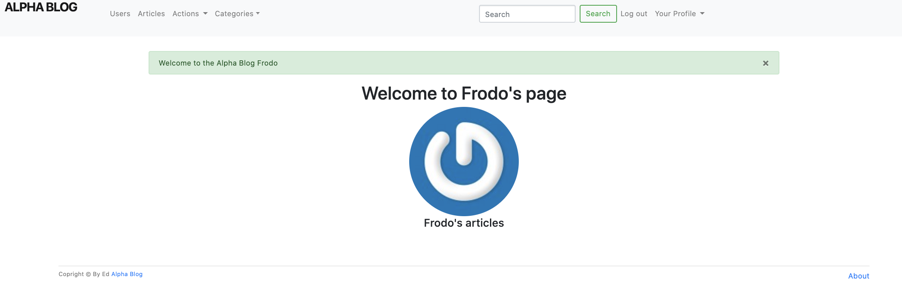
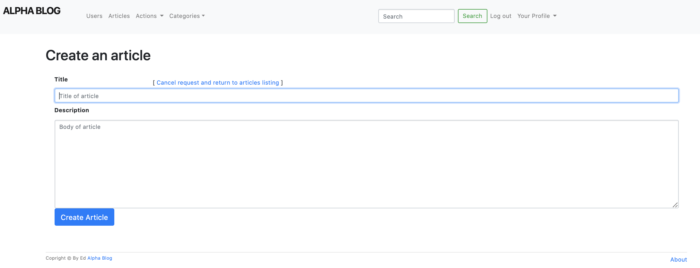

# Alpha Blog

**Alpha Blog Webb App** been build with Ruby on Rails framework and coded using **Ruby** as a language. Bootstrap been used for main UI elements to add more modern feel to web app.

**Alpha Blog** is a simple web app that enables users to blog and post various articles by sharing it with community. Login functionality been added to enable data privacy when using web app.

_The inspiration behind the project:_ Learn Ruby on Rails framework and deliver MVP.

See the full project on [GitHub.][1]

### Alpha Blog

[Specification](#specification) | [Tech Stack](#tech-stack) | [Installation](#installation) | [Development Process](#development-process) | [Further development](#further-development)

# Specification

The app enables users to blog and post various articles by sharing it with community. Login functionality been added to enable data privacy when using web app.

Users able to brows other users posted blogs. Functionality for only article owners to edit, delete articles. User have added feature of personal profile view with ability to share own profile picture.

# Tech Stack:

- [Ruby on Rails](https://rubyonrails.org/) to deliver full MVC.
- [PostgreSQL](https://www.postgresql.org/) as database for data storage. User details and messages.
- [Bootstrap](https://getbootstrap.com/) & CSS for styling.

# Installation

- Clone this repository
  `$ git clone https://github.com/EdAncerys/alpha_blog`
- Navigate to local repository
  `$ cd alpha_blog`
- Install all dependencies
  `$ brew bundle`
- Add/install database structure locally.  
  `$ rails db:create:all`  
  `$ rails db:migrate`
- Start the server
  `$ rails s`
- Navigate to [http://localhost:3000](http://localhost:3000) in your browser

# Development Process

During development process I used an agile development methodologies of using git, commit messages, git branches, merges and regular code refactor.

## MVP

My aim for the MVP was to have an interface with login/logout functionality, and a UI with ability to post and share blogs and articles with community and friends.

## User Stories

```
As a user
So I can use the alpha blog
I want to be able to log in
```

```
As a user
So I can securely leave my account
I want to be able to logout
```

```
As a user
So I can share my blog
I want to be able create a blog
```

```
As a user
So I can edit my blog later down the line
I want to be able edit blogs published
```

```
As a user
So I can change my mind
I want to be able to delete the blog
```

```
As a user
So I can show my mug
I want to be able to share have my profile picture
```

## Alpha Blog Web App UI

### User profile view

<p align="center">
    
</p>

### Create new article view

<p align="center">
    
</p>

# Further development

To extend app functionality following features can be added:

- Add feature to share/post to different platforms
- Add functionality to login via popular social media platforms

[1]: https://github.com/EdAncerys/alpha_blog
